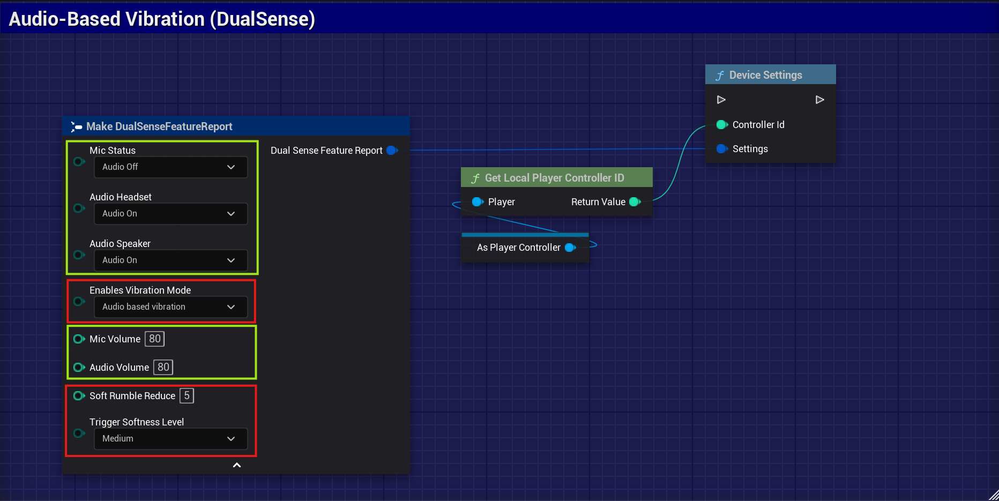
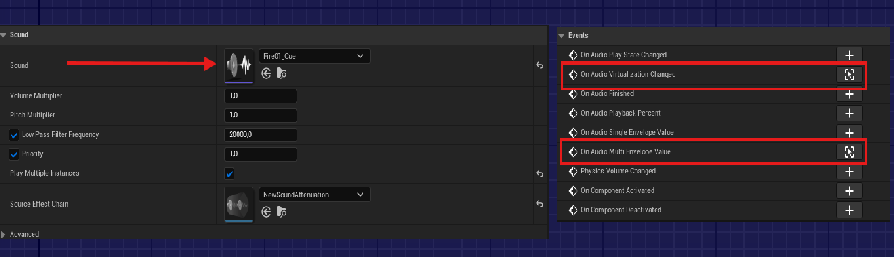
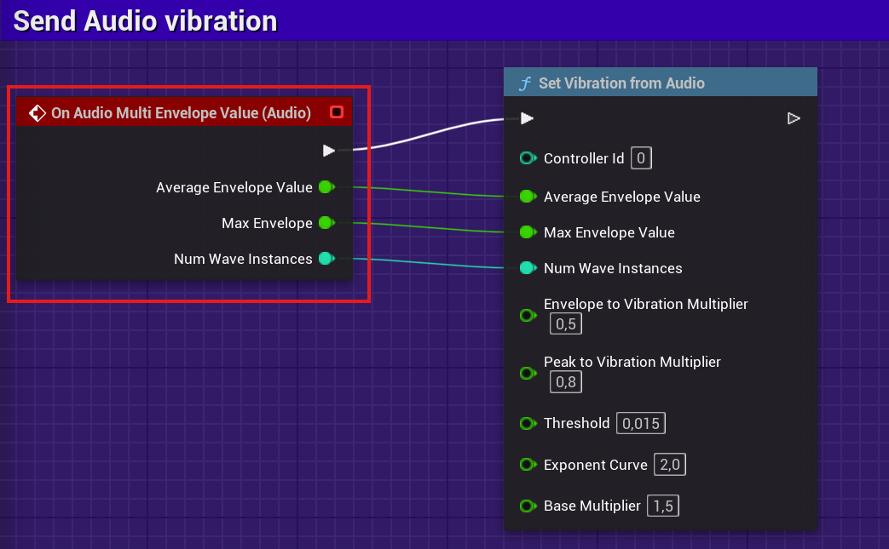
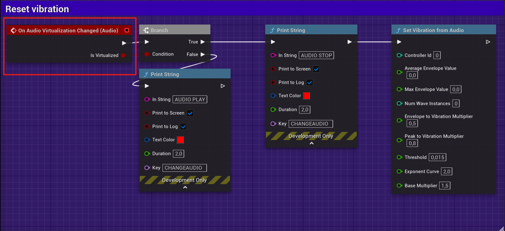
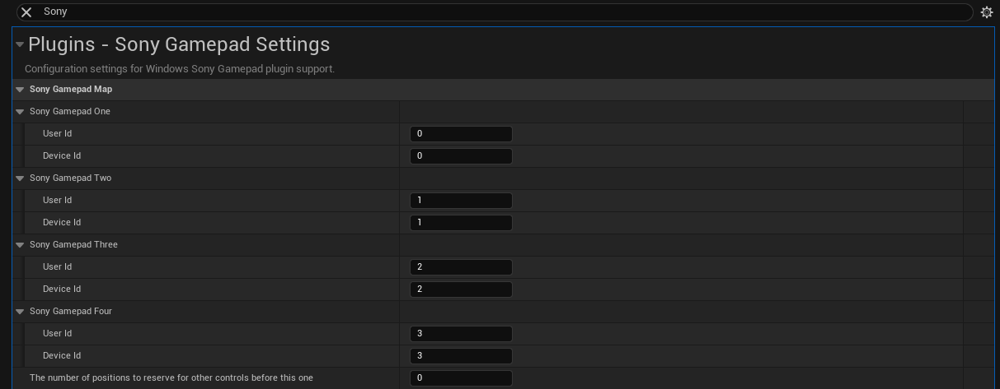
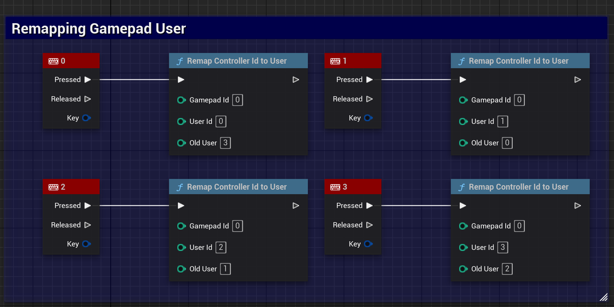

# Windows DualSense & DualShock 4 Plugin para Unreal Engine

 

**Plugin para Windows que adiciona suporte nativo e avançado aos controles Sony DualSense (PS5) e DualShock 4 (PS4) no Unreal Engine 5.2 ~ 5.6. Instalação facilitada via FAB, sem necessidade de configuração manual.**

- Personalize vibração, haptics, LEDs, triggers e mais.
- Interfaces para Blueprints e C++.
- Totalmente integrado ao sistema de force feedback do Unreal Engine.
- Suporte a multiplayer local com múltiplos controles.

[Veja vídeo de uso](https://www.youtube.com/watch?v=GrCa5s6acmo)

## 1. Instalação Rápida

1. **Acesse a página oficial do plugin no FAB:**  
   [Página do Plugin - FAB](https://www.fab.com/listings/e77a8f1d-8bbe-4673-a5ae-7f222c8c0960)

2. **Clique em _Install_ ou _Add to Project_**  
   Selecione seu projeto Unreal Engine.

3. **Ative o plugin no Unreal Engine:**
   - Abra seu projeto.
   - Vá até `Edit > Plugins`.
   - Procure por `Windows DualSense Plugin` e ative.
   - Reinicie o Unreal Engine.

   Pronto! O plugin já estará pronto para uso.

## Configurações Gerais para DualSense e DualShock 4
O plugin permite configurar funcionalidades essenciais para ambos os controles:

- **Vibração**: A intensidade das vibrações pode ser ajustada, permitindo desde valores elevados até desativação completa, conforme a preferência do usuário ou necessidade do jogo.
- **Gatilhos (gatilhos adaptativos no DualSense)**: Nos controles compatíveis, é possível customizar a força necessária para pressionar os gatilhos, ativando efeitos como resistência dinâmica, resposta tátil, ou ajuste da suavidade do acionamento.
- **LEDs e Feedback**: Ajuste de efeitos de luz e retorno visual, além de indicações de jogador, nível de bateria e notificações rápidas.
- **Personalização em Tempo Real**: Todas as configurações podem ser alteradas durante a execução do jogo, sem a necessidade de reconectar ou reiniciar controles.

## Light Bar
A cor da light bar dos controles pode ser alterada dinamicamente durante o jogo, permitindo indicar status, jogadores ou fornecer feedback visual ao usuário.

## Vibração dos Motores (Force Feedback)
A vibração dos motores do DualSense e DualShock 4 é ativada automaticamente pelo sistema de **force feedback** do Unreal Engine.
Isso significa que qualquer evento de force feedback já suportado nativamente pelo Unreal (Blueprints ou C++) irá acionar a vibração dos motores dos controles, sem necessidade de configuração adicional.
- **Como usar:**
  Basta adicionar eventos de force feedback no seu projeto Unreal normalmente.
  O plugin garante compatibilidade dos motores de vibração dos controles PlayStation com essas ações.

### Configuração: Redução da Vibração e Intensidade dos Gatilhos
Permite ajustar e reduzir a força das vibrações (rumble) e a intensidade dos efeitos dos gatilhos adaptativos do controle DualSense, conforme desejado pelo usuário ou via lógica do jogo.

## Efeitos dos Gatilhos (DualSense)
Os controles DualSense suportam efeitos especiais nos gatilhos adaptativos:
- **Galloping:** Efeito de pulsação simulando galope.
- **Resistance:** O gatilho fica mais pesado em certas posições.
- **AutomaticGun:** Sensação de disparo automático.
- **SemiAutomaticGun:** Resposta tátil para tiro semi-automático.

Galloping

Resistance

AutomaticGun

SemiAutomaticGun

## Vibração Baseada em Áudio e Configurações de Áudio (DualSense)
Configura o Áudio e a vibração do DualSense conforme o áudio do jogo.

No método Blueprint **DeviceSettings**, ajuste a sensibilidade, intensidade e resposta da vibração com base no áudio. Também é possível configurar o volume do microfone, áudio do headset e speaker.

> **Nota:** As configurações de áudio e vibração avançada estão disponíveis apenas quando o controle DualSense está conectado via **USB**.
>

Mesmo via **Bluetooth**, é possível utilizar a vibração sincronizada com o áudio do jogo através do método `SetVibrationFromAudio`. Essa funcionalidade permite feedback tátil baseado no áudio capturado em tempo real.

1. **Create a new Blueprint Actor** named `BP_Fire`.
2. In the Blueprint, add a **fire particle system**. Inside the particle system component, add an **audio component**.
3. Select the audio component and assign an audio asset to it.
4. In the audio component, go to **Events** and click to create new events.
5. Call the `SetVibrationFromAudio` function, passing the parameters as shown in the example below.
6. **Add the blueprint to your game level**. When the player character approaches and the fire particle system starts playing, the controller will receive vibration feedback based on the audio.

## Multiplayer
### Exemplo: Multiplayer com 4 Jogadores
No seu GameMode, utilize o evento **PostLogin** para criar e configurar até 4 jogadores. Cada vez que um jogador conecta, um novo player é adicionado e associado ao respectivo controle.

## Remapeando Usuários do Gamepad
Você pode definir qual usuário do Unreal Engine é associado a cada controle DualSense ou DualShock 4 diretamente no arquivo de configurações do plugin ().
Isso é muito útil em jogos multiplayer local ou split-screen, onde a ordem dos controles (Jogador 1, Jogador 2, etc.) deve ser controlada.

`` Edit > Project Settings > Plugins > Sony Gamepad Settings``
1. **Ajuste os UserIds:**
   Para cada controle listado, ajuste o `UserId` conforme sua ordem de jogadores:
   - `Sony Gamepad One` com UserId 0 para Jogador 1
   - `Sony Gamepad Two` com UserId 1 para Jogador 2
2. **Salve as alterações:**
   Clique em “Save” no canto inferior direito das Configurações do Projeto.
3. **Reinicie o Editor:**
   Recomenda-se reiniciar o Unreal Editor para garantir que as alterações entrem em vigor.

### Remapeamento Dinâmico do Gamepad
Permite trocar qual controle está associado a cada jogador durante a execução do jogo, sem precisar reiniciar. Útil em multiplayer local ou troca rápida de controles em tempo real.

## Contributors ✨

Thanks go to these wonderful people ([emoji key](https://allcontributors.org/docs/en/emoji-key)):
<!-- ALL-CONTRIBUTORS-LIST:START - Do not remove or modify this section -->
<!-- All contributors will be added here automatically -->
<!-- ALL-CONTRIBUTORS-LIST:END -->

[DualSense on Windows API](https://github.com/Ohjurot/DualSense-Windows), [Nielk1 on GIST](https://gist.github.com/Nielk1/6d54cc2c00d2201ccb8c2720ad7538db), [DualSenseAPI](https://github.com/BadMagic100/DualSenseAPI/tree/master), [flok pydualsense](https://github.com/flok/pydualsense).

---
## 📍 Roadmap

To follow ongoing development and planned features for DualShock and DualSense support, please check our project roadmap:

[🔗 View the Roadmap on GitHub Projects](https://github.com/users/rafaelvaloto/projects/2)

---
