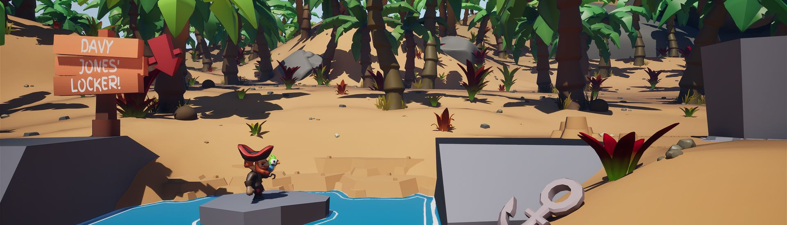
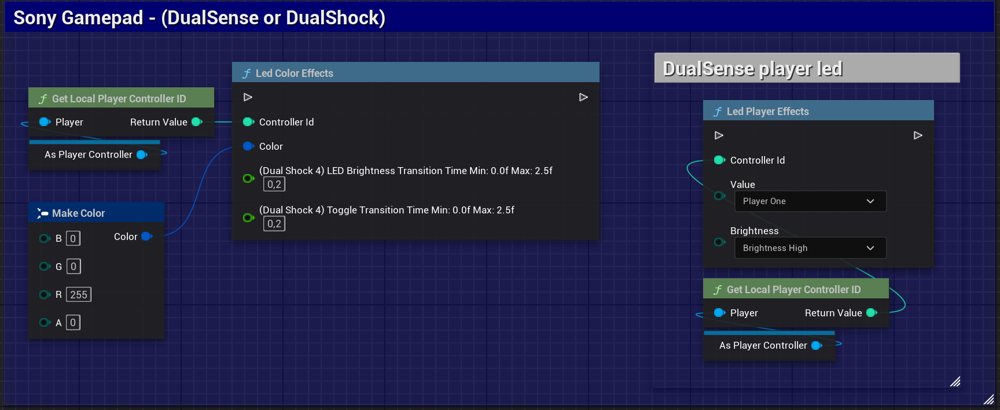
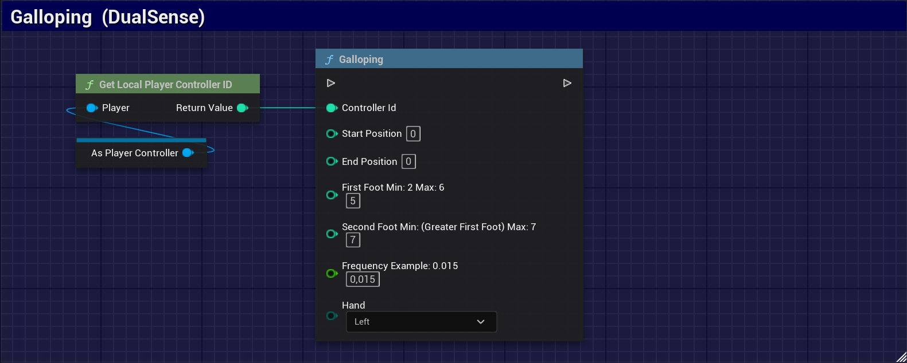
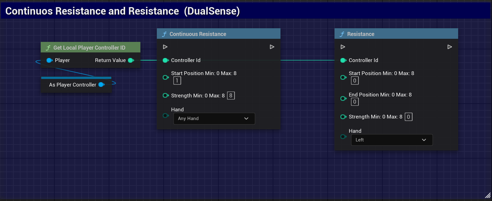
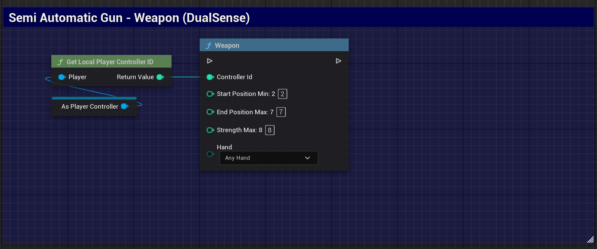
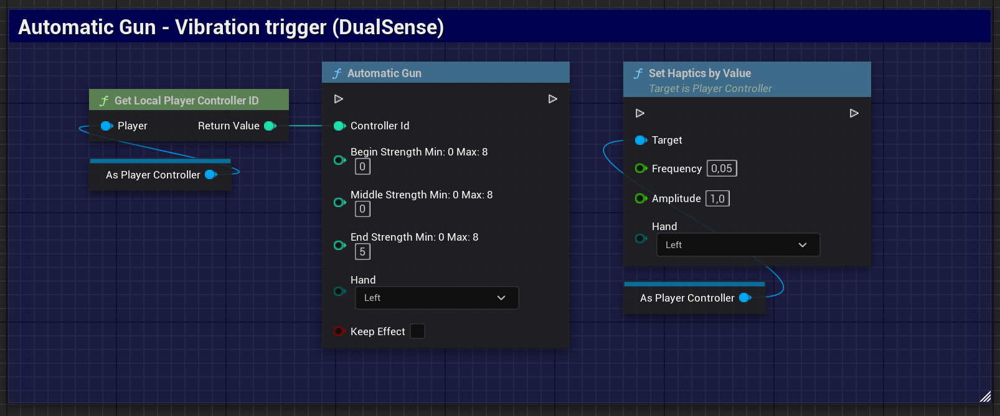
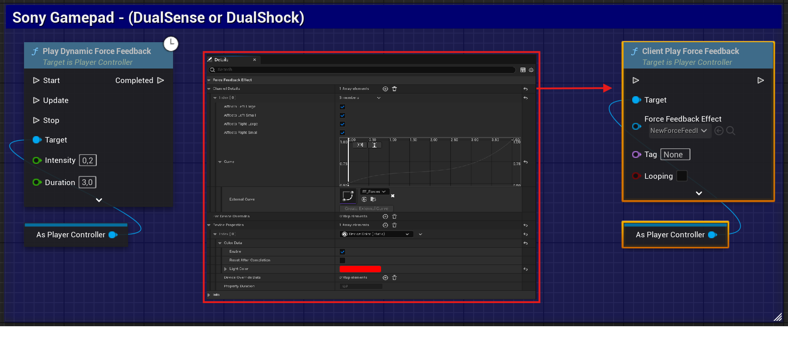
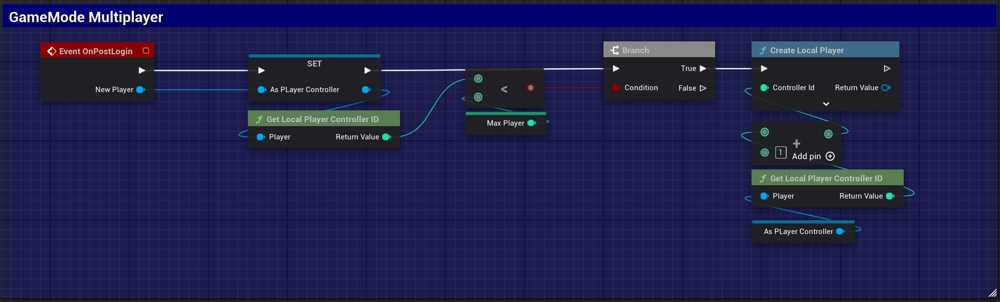

<h1 align="center">Windows Dualsense Unreal Plugin</h1>

Integrate all the features of Sony's DualSense™ and DualShock 4® controllers into your Unreal Engine project for Windows.
 
 
<a href="https://github.com/rafaelvaloto/WindowsDualsenseUnreal/issues">Report Bug</a>
·
<a href="https://github.com/rafaelvaloto/WindowsDualsenseUnreal/issues">Suggest a Feature
</a>

  

## 📖 About the Project

This is an Unreal Engine plugin that enables native communication with DualSense™ (PlayStation 5) and DualShock 4® (PlayStation 4) controllers on Windows systems. It exposes the unique features of each controller, such as Haptic Feedback and Adaptive Triggers of DualSense, through an easy-to-use Blueprint and C++ function library.

The goal is to bridge the gap left by generic controller support on Windows, giving developers direct access to the features that make Sony controllers so immersive.

## ✨ Features

* 🔌 **Dynamic Connection (Hot-Swap)**: Automatically detects controller connection and disconnection, even during gameplay.
* ⚡ **Optimized for Multiplayer**: High-performance architecture with minimal impact on network games.
* 🎮 **Seamless Input Integration**: Coexists perfectly with Unreal Engine's native input managers (like Enhanced Input) and other gamepad plugins, preventing conflicts between devices.
* 🎯 **Adaptive Triggers**: Full control over resistance, effect, and vibration on R2/L2 triggers.
* 🔊 **Audio-Based Vibration**: Synchronize the controller's haptic feedback with any in-game audio source.
* 💡 **Lightbar Control**: Dynamically change the controller's LED color.
* 🎤 **Microphone and Audio**: Manage the mute button LED, speaker volume, and headset audio.
* ⚙️ **Force Feedback**: Native integration with Unreal Engine's Force Feedback system for standard motor vibration.
* 🎮 **Multi-Controller Support**: Manage up to 4 controllers simultaneously.

## 🎬 Demo

To see the plugin in action, watch the basic usage video on YouTube.

[Watch usage video](https://www.youtube.com/watch?v=GrCa5s6acmo)

## 🎮 Example Project: Parrot Game Sample

To demonstrate the practical use of the **Windows Dualsense Unreal Plugin**, a sample project has been developed using the [*Parrot Game Sample*](https://dev.epicgames.com/documentation/en-us/unreal-engine/parrot-game-sample-for-unreal-engine) from Epic Games. This project integrates key features of the DualSense controller to enhance the player's experience.

### Implemented Features

In this sample, the following DualSense functionalities were integrated to provide a more immersive gameplay experience:

* **Visual Feedback**: The controller's Lightbar is used to provide real-time visual feedback to the player, changing colors and effects according to in-game events.
* **Vibration (Force Feedback)**: The native Force Feedback system was used to create detailed vibration effects, increasing immersion during key moments of gameplay.

> 💡 **Pro Tip for Deeper Immersion**: For an enhanced audio experience, connect the controller via USB and plug a headset directly into it. This setup also works with a Bluetooth connection, offering greater flexibility.

This project serves as a practical guide for developers who want to see the plugin in action and learn how to integrate the unique features of the DualSense controller into their own games.

### Where to Download

You can download the *Parrot Game Sample* with the DualSense integration directly from our GitHub repository.

- [**Download the example project here**](https://drive.google.com/file/d/198Dko7ZwIX1vz9jw7RtYp4arY9Qp5bJ4/view?usp=drive_link)

## 🚀 Getting Started

### Prerequisites

* **Unreal Engine**: 5.2 or higher.
* **Operating System**: Windows 10 or 11.
* **Controller**: DualSense™ or DualShock 4®.

### Quick Installation

1.  Go to the official plugin page on the Unreal Engine Marketplace (FAB): [Plugin Page - FAB](https://www.fab.com/listings/e77a8f1d-8bbe-4673-a5ae-7f222c8c0960)
2.  Click **Install** or **Add to Project** and select your Unreal Engine project.
3.  Activate the plugin in Unreal Engine:
    * Open your project.
    * Go to `Edit > Plugins`.
    * Search for **Windows Dualsense Plugin** and check the box.
4.  Restart Unreal Engine when prompted.

## 💻 Basic Usage

The plugin exposes all functionality through static Blueprint function libraries, meaning you can call methods from anywhere without needing to add components.

### Blueprint Function Libraries

The functions are divided into two main categories for easy access:

* **Sony Gamepad**: Contains management methods common to Sony controllers (DualShock and DualSense), such as LED control, gyroscope, battery level, etc.
* **DualSense Effects**: Contains methods specific to DualSense exclusive features, such as Adaptive Triggers configuration.

**Example 1: Light Control (Lightbar & LEDs)**
You can dynamically change the controller's Lightbar color or set the player indicator LEDs.

**Example 2: Trigger Effects (Category: DualSense Effects)**
Call functions directly to control DualSense features. Some available effects include:

* 🐎 **Galloping**: Simulates a horse's trot.
* 💪 **Resistance**: Applies constant opposing force when pressing the trigger.
* 🔫 **Weapon**: Creates a recoil effect for semi-automatic weapons.
* 🔥 **Automatic Gun**: Vibrates rapidly to simulate an automatic weapon.

### Motor Vibration (Force Feedback)

The motor vibration of both DualSense and DualShock 4 is automatically handled by Unreal Engine's native **Force Feedback** system. This means any force feedback event will trigger the controller's vibration without extra setup.

### Multiplayer Management

To manage multiple controllers in a local scenario, the recommended approach is to use your project's **GameMode**. In the `PostLogin` event, you can assign a controller to each new player that connects.

## 🤝 How to Contribute

Contributions are welcome! If you have ideas, suggestions, or bug fixes, feel free to open an *Issue* or submit a *Pull Request*.

## 📄 License

This project is distributed under the MIT License. See the `LICENSE` file for more details.

## ⭐ Credits and Acknowledgments

Special thanks to everyone who has contributed with suggestions, reported bugs, and offered implementation improvements. Thanks also to the developers of the libraries used as inspiration and reference for creating this project.

A special thanks as well to the Epic Games team for creating and providing the *Parrot Game Sample*, which served as an excellent foundation for the example project demonstrating this plugin's features.

* [DualSense on Windows API](https://github.com/Ohjurot/DualSense-Windows)
* [Nielk1 on GIST](https://gist.github.com/Nielk1/6d54cc2c00d2201ccb8c2720ad7538db)
* [DualSenseAPI](https://github.com/BadMagic100/DualSenseAPI/tree/master)
* [flok pydualsense](https://github.com/flok/pydualsense)