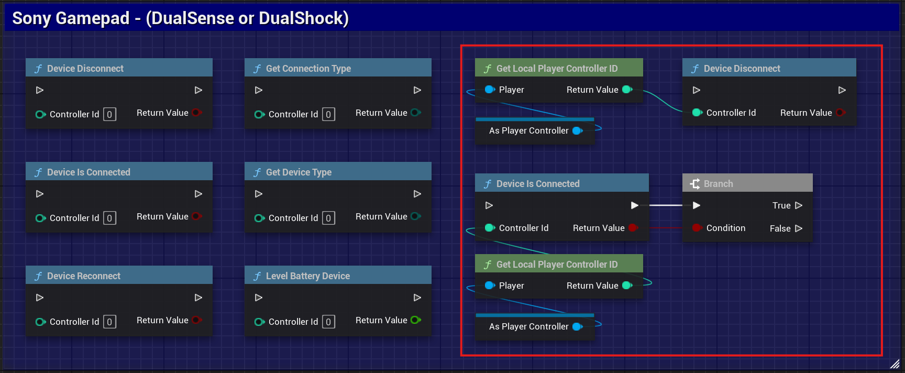
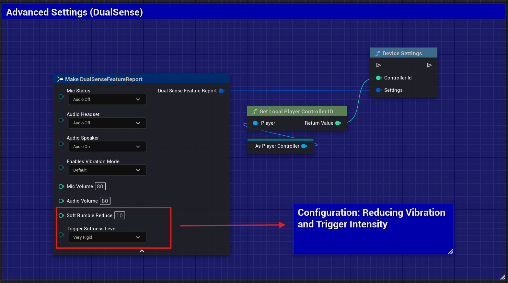

<h1 align="center">Windows Dualsense Unreal Plugin</h1>

<p align="center">
Integrate all the features of Sony's DualSense™ controller into your Unreal Engine project for Windows.
<br />
<br />
<a href="https://github.com/rafaelvaloto/WindowsDualsenseUnreal/issues">Reportar Bug</a>
·
<a href="https://github.com/rafaelvaloto/WindowsDualsenseUnreal/issues">Suggest a Feature
</a>
</p>

<p align="center">
<a href="https://github.com/rafaelvaloto/WindowsDualsenseUnreal/releases">
    
</a>
<a href="https://github.com/rafaelvaloto/WindowsDualsenseUnreal/blob/main/LICENSE">
    
</a>
 <br>

</p>


## 📋 Table of Contents

- [About the Project](#-about-the-project)
- [✨ Features](#-features)
- [🚀 Getting Started](#-getting-started)
    - [Prerequisites](#prerequisites)
    - [Installation](#installation)
- [💻 Basic Usage](#-basic-usage)
- [📚 Documentation](#-documentation)
- [🤝 How to Contribute](#-how-to-contribute)
- [📄 License](#-license)

## 📖 About the Project

This is an Unreal Engine plugin that enables native communication with DualSense™ (PlayStation 5) and DualShock 4® (
PlayStation 4) controllers on Windows systems. It exposes the unique features of each controller, such as Haptic
Feedback and Adaptive Triggers of DualSense, through an easy-to-use Blueprint and C++ function library.

The goal is to bridge the gap left by generic controller support on Windows, giving developers direct access to the
features that make Sony controllers so immersive.


## 🚀 Getting Started

### Prerequisites

🚀 Unreal Engine: 5.2 or higher.

🪟 Operating System: Windows 10 or 11.

🎮 Controller: DualSense™ or DualShock 4®.

### Quick Installation

1. Access the official plugin page on FAB: Plugin Page - FAB


2. Click Install or Add to Project Select your Unreal Engine project.


3. Activate the plugin in Unreal Engine:
    - Open your project.
    - Go to ```Edit > Plugins```.
    - Search for Windows DualSense Plugin and check the box.

Restart Unreal Engine when prompted.

## ✨ Features

✅ Haptic Feedback: Complete control over low and high-frequency vibration.

🔊 Audio-Based Vibration: Synchronize the controller's haptic feedback with any game audio source in real-time.

🎯 Adaptive Triggers: Configure resistance, effect, and vibration on R2/L2 triggers.

🎚️ Intensity Control: Precise adjustment of adaptive trigger force and overall vibration intensity.

💡 Touchpad Light (Lightbar): Dynamically change the controller's LED color.

🎤 Microphone LED (Mute Button): Control the mute button LED state.

🔈 Audio Control: Manage the built-in speaker volume and connected headset microphone.

🎮 Multiple Controller Support: Manage up to 4 DualSense controllers simultaneously connected.


## 🎬 Demo

[Watch usage video](https://www.youtube.com/watch?v=GrCa5s6acmo)


## 💻 Basic Usage

The plugin exposes all functionality through static function libraries in Blueprint, which means you can call methods
from anywhere without needing to add components.

How to Use Blueprint Functions
The functions are divided into two main categories for easy access:

Sony Gamepad: Contains management methods common to Sony controllers (DualShock and DualSense), such as connection, LED
control, gyroscope, etc.

DualSense Effects: Contains methods specific to DualSense exclusive features, such as Adaptive Triggers configuration.

Example 1: Connection Management (Category: Sony Gamepad)
You can check if a controller is connected and manage its connection directly.



💡 Touchpad Light (Lightbar): Dynamically change the controller's LED color.


Example 2: Call functions directly to control DualSense features. Some of the available trigger effects include:

- 🐎 Galloping: Simulates horse trotting.
- 💪 Resistance: Applies constant opposing force when pressing the trigger.
- 🔫🔥 Automatic Gun: Vibrates rapidly to simulate an automatic weapon.
- 🔫 Semi-Automatic Gun: Creates quick recoil to simulate a single shot.


## ⚙️ Motor Vibration (Force Feedback)

The motor vibration of DualSense and DualShock 4 is automatically activated by Unreal Engine's force feedback system.
This means that any force feedback event natively supported by Unreal (Blueprints or C++) will trigger the controller's
motor vibration without additional configuration.

How to use:
Simply add force feedback events to your Unreal project as normal.
The plugin ensures compatibility of PlayStation controllers' vibration motors with these actions.




## 🎮 Multiplayer

To manage multiple controllers in a local scenario, the recommended approach is to use GameMode.

Example: 4-Player Multiplayer
In your GameMode, use the PostLogin event to create and configure up to 4 players. Each time a player connects, a new
player is added and associated with their respective controller.


## 🤝 How to Contribute

Contributions are welcome! If you have ideas, suggestions, or corrections, feel free to open an *Issue* or submit a
*Pull Request*.


## 📄 License

This project is distributed under the MIT license. See the `LICENSE` file for more details.


## ⭐ Credits and Acknowledgments

Special thanks to everyone who has contributed with suggestions, reported bugs, and offered implementation improvements.
Thanks also to the developers of the libraries used as inspiration and reference for creating this project.

- [DualSense on Windows API](https://github.com/Ohjurot/DualSense-Windows)
- [Nielk1 on GIST](https://gist.github.com/Nielk1/6d54cc2c00d2201ccb8c2720ad7538db)
- [DualSenseAPI](https://github.com/BadMagic100/DualSenseAPI/tree/master)
- [flok pydualsense](https://github.com/flok/pydualsense)


