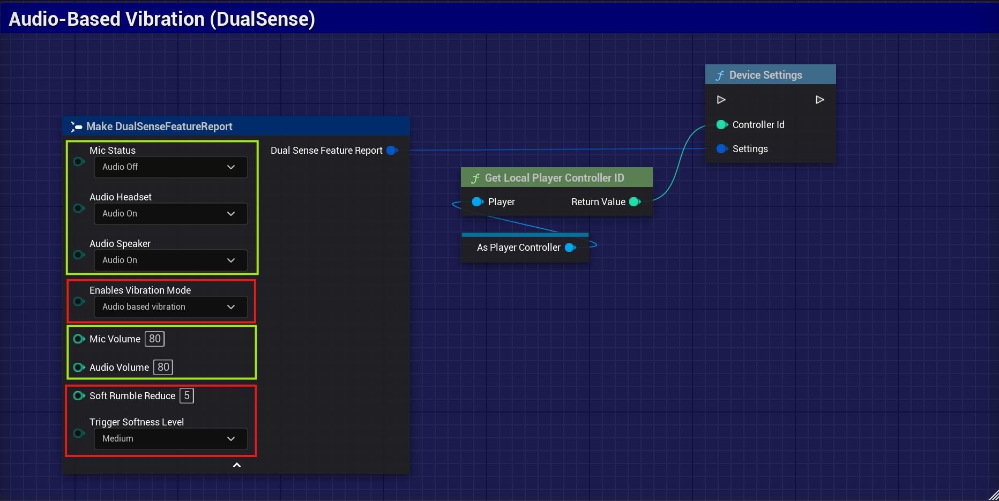
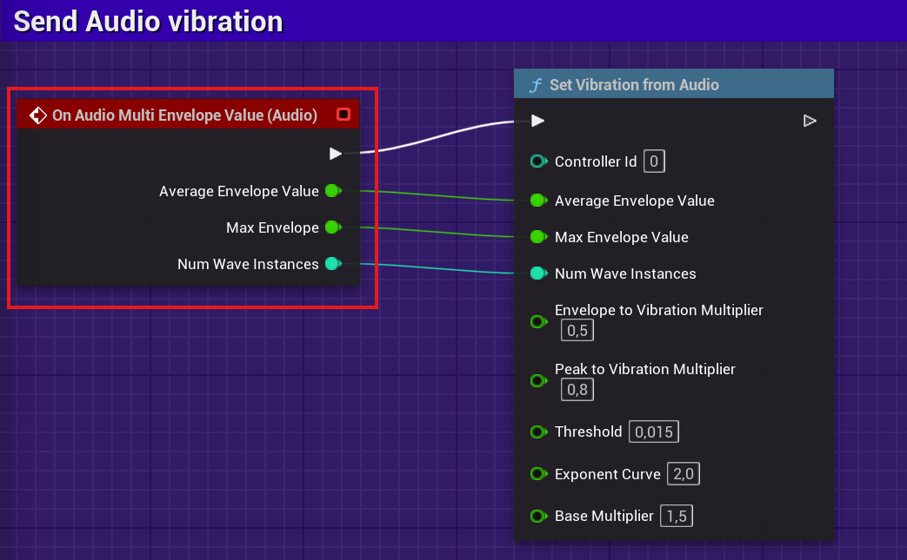
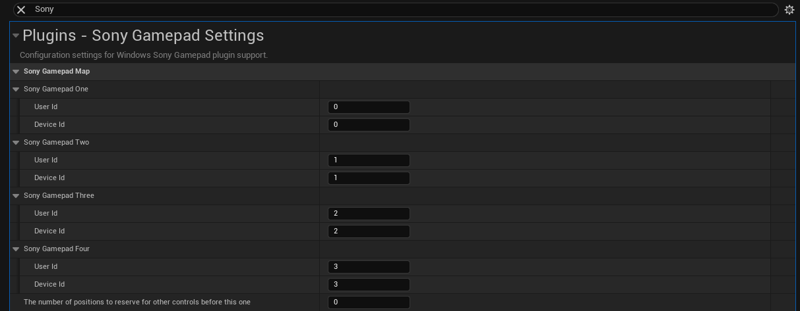

# Windows DualSense & DualShock 4 Plugin for Unreal Engine

 

**A Windows plugin that adds native and advanced support for Sony DualSense (PS5) and DualShock 4 (PS4) controllers to Unreal Engine 5.2 ~ 5.6. Easy installation via FAB, with no need for manual configuration.**

- Customize vibration, haptics, LEDs, triggers, and more.
- Interfaces for both Blueprints and C++.
- Fully integrated with Unreal Engine's force feedback system.
- Supports local multiplayer with multiple controllers.

[See usage video](https://www.youtube.com/watch?v=GrCa5s6acmo)

## 1. Quick Installation

1. **Go to the plugin's official page on FAB:**  
   [Plugin Page - FAB](https://www.fab.com/listings/e77a8f1d-8bbe-4673-a5ae-7f222c8c0960)

2. **Click _Install_ or _Add to Project_**  
   Select your Unreal Engine project.

3. **Enable the plugin in Unreal Engine:**
   - Open your project.
   - Go to `Edit > Plugins`.
   - Search for `Windows DualSense Plugin` and enable it.
   - Restart Unreal Engine.

   Done! The plugin is now ready to use.

## General Settings for DualSense and DualShock 4
The plugin allows you to configure essential features for both controllers:

- **Vibration:** Adjust vibration intensity, allowing for high, low, or even completely disabled feedback, according to user preference or game needs.
- **Triggers (adaptive triggers on DualSense):** On compatible controllers, you can customize the required force for pressing triggers, enabling effects like dynamic resistance, tactile feedback, or smoother activation.
- **LEDs and Feedback:** Adjust light effects and visual feedback, including player indication, battery level, and quick notifications.
- **Real-Time Customization:** All settings can be changed during gameplay, with no need to reconnect or restart controllers.

## Light Bar
The color of the controller's light bar can be changed dynamically during gameplay, allowing you to indicate status, players, or other forms of visual feedback to the user.

## Motor Vibration (Force Feedback)
Motor vibration for DualSense and DualShock 4 is automatically triggered by Unreal Engine's native **force feedback** system.
This means any supported force feedback event in Unreal (Blueprints or C++) will activate controller motors—no extra configuration needed.

- **How to use:**
  Simply add force feedback events to your Unreal project as usual.
  The plugin ensures PlayStation controller motors are fully compatible with those actions.

### Setting: Vibration and Trigger Intensity Reduction
Allows you to adjust and reduce the strength of vibration (rumble) and intensity of DualSense adaptive trigger effects, as desired by the user or via game logic.

## Trigger Effects (DualSense)
DualSense controllers support special effects on adaptive triggers:
- **Galloping:** Pulsating effect simulating gallop.
- **Resistance:** The trigger becomes harder to press at certain positions.
- **AutomaticGun:** Simulates full-auto fire feel.
- **SemiAutomaticGun:** Tactile response for semi-auto shots.

Galloping

Resistance

AutomaticGun

SemiAutomaticGun

## Audio-Based Vibration and Audio Configurations (DualSense)
Set up DualSense audio and vibration based on in-game audio.

In the **DeviceSettings** Blueprint method, adjust the vibration's sensitivity, intensity, and response based on audio. You can also configure microphone volume, headset audio, and speaker output.

> **Note:** Advanced audio and vibration settings are only available when the DualSense controller is connected via **USB**.
>

Even via **Bluetooth**, you can enable vibration synced with in-game audio using the `SetVibrationFromAudio` method. This feature provides real-time tactile feedback based on captured audio.

1. **Create a new Blueprint Actor** named `BP_Fire`.
2. In the Blueprint, add a **fire particle system**. Inside the particle system component, add an **audio component**.
3. Select the audio component and assign an audio asset to it.
4. In the audio component, go to **Events** and click to create new events.
5. Call the `SetVibrationFromAudio` function, passing in the parameters as shown in the example below.
6. **Add the blueprint to your game level**. When the player character approaches and the fire particle system starts playing, the controller will receive vibration feedback based on the audio.

## Multiplayer
### Example: Multiplayer with 4 Players
In your GameMode, use the **PostLogin** event to create and set up to 4 players. Each time a player connects, a new player is added and associated with the respective controller.

## Remapping Gamepad Users
You can specify which Unreal Engine player is associated with each DualSense or DualShock 4 controller directly in the plugin configuration file.
This is useful for local multiplayer or split-screen games, where controller order (Player 1, Player 2, etc.) must be controlled.

`` Edit > Project Settings > Plugins > Sony Gamepad Settings``
1. **Adjust the UserIds:**
   For each listed controller, set the `UserId` based on your desired player order:
   - `Sony Gamepad One` with UserId 0 for Player 1
   - `Sony Gamepad Two` with UserId 1 for Player 2
2. **Save your changes:**
   Click “Save” at the bottom right of Project Settings.
3. **Restart the Editor:**
   It is recommended to restart Unreal Editor to ensure changes take effect.

### Dynamic Gamepad Remapping
Allows you to switch which controller is associated with each player during gameplay without needing to restart. Useful for local multiplayer or real-time controller switching.

## Contributors ✨

<!-- ALL-CONTRIBUTORS-LIST:START -->
| [ <b>@theadamrippon</b>](https://github.com/theadamrippon) | [ <b>@Loriborn</b>](https://github.com/Loriborn) | [ <b>@Deooed</b>](https://github.com/Deooed) |
|:------------------------------------------------------:|:----------------------------------------------------------:|:---------------------------------------------------------:|
|                             💻                          |                        💻 💡                               |                            💻                             |
<!-- ALL-CONTRIBUTORS-LIST:END -->

[DualSense on Windows API](https://github.com/Ohjurot/DualSense-Windows), [Nielk1 on GIST](https://gist.github.com/Nielk1/6d54cc2c00d2201ccb8c2720ad7538db), [DualSenseAPI](https://github.com/BadMagic100/DualSenseAPI/tree/master), [flok pydualsense](https://github.com/flok/pydualsense).

---
## 📍 Roadmap

To follow ongoing development and planned features for DualShock and DualSense support, please check our project roadmap:

[🔗 View the Roadmap on GitHub Projects](https://github.com/users/rafaelvaloto/projects/2)

---